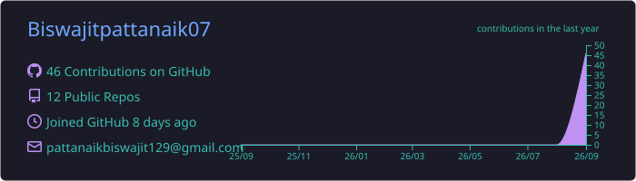
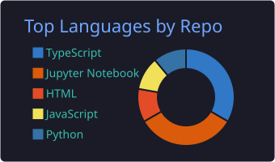
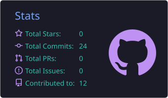
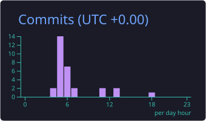

<h1 align="center">Hi 👋, I'm Biswajit Pattanaik</h1>

<p align="center">
  <a href="https://github.com/Biswajitpa">
    <picture>
      <source media="(prefers-color-scheme: dark)" srcset="assets/dark.svg?v=3">
      <source media="(prefers-color-scheme: light)" srcset="assets/light.svg?v=3">
      
    </picture>
  </a>
</p>

<p align="center">
  
  
  
  
  
  
  
</p>

<p align="center">
  
</p>

<p align="center">
  <a href="https://www.linkedin.com/in/biswajit-pattanaik-3586b82b3">
    
  </a>
  <a href="https://github.com/Biswajitpattanaik07">
    
  </a>
  <a href="mailto:pattanaikbiswajit07@gmail.com">
    
  </a>
</p>

<p align="center">
  
  
  
</p>

<p align="center">
  
</p>

---

### 🚀 At a Glance

- Embedded Systems Developer · IoT Engineer · Backend Developer
- Expertise in DSA (C++), AI/ML, Cloud Computing, and Full-Stack Development
- Building real-time, scalable, and intelligent systems
- 🎯 Open to Internships & Full-Time Opportunities — available for immediate roles

---

## 💫 About Me

Results-driven Embedded Systems and Software Developer with strong expertise across the full technology stack — from low-level hardware interfacing and sensor integration to cloud deployment and AI-powered application development.

Experienced in designing and implementing end-to-end IoT solutions that connect physical devices with scalable, data-driven backend systems, ensuring reliable and efficient system performance. Possesses a strong foundation in Data Structures and Algorithms, enabling the development of optimized, production-ready software across embedded, web, and enterprise environments.

Known for a systematic problem-solving approach and a strong passion for leveraging IoT, AI/ML, and modern software engineering practices to build innovative, scalable solutions that automate processes and deliver measurable real-world impact.

---

## 🔭 Current Focus

| Area | Details |
|---|---|
| 🚗 Automotive Embedded Systems | CAN, AUTOSAR |
| 📡 IoT + Cloud Integration | ESP32 + Raspberry Pi |
| 🤖 AI/ML in Embedded Systems | Applied ML on constrained devices |
| 🧠 AI & ML | Model development, deployment, and MLOps |
| 🏗 System Designing | Scalable, fault-tolerant architecture patterns |
| ⚙️ DevOps | CI/CD pipelines, containerization, cloud infra |
| 💻 Backend Systems | Node.js + APIs |

---

## 📚 Currently Learning

<p align="left">
  
  
  
  
</p>

## 💬 Ask Me About

<p align="left">
  
  
  
  
  
</p>

## 🎯 Skills Proficiency

<p align="left">
  <b>Embedded Systems & IoT</b><br/>
  <br/>
  <b>Backend Development (Node.js)</b><br/>
  <br/>
  <b>Full-Stack (MERN / Next.js)</b><br/>
  <br/>
  <b>AI / ML</b><br/>
  <br/>
  <b>DSA (C++)</b><br/>
  <br/>
  <b>Cloud & DevOps</b><br/>
  
</p>

---

## 🎓 Education & Milestones

```
2024 — Present   🏫  Pursuing degree, deepening focus on Embedded Systems & AI
2025            🏆  IEEE Tech Spark 2.0 — Winner
2025            🚗  Built AI Vehicle Black Box (embedded telemetry system)
2026            🚕  Shipped RYDEX — full-stack AI mobility platform
2026            🛒  Shipped CartSphere — multi-vendor e-commerce SaaS
2026            🚆  Built Bharatiya Rail Track Fault Detection AI
```

<!-- Update the dates/entries above to match your actual timeline -->

---

## ⚡ Fun Fact

> Went from wiring sensors on a breadboard to shipping full AI-powered web apps — still can't decide if I love hardware or software more, so I do both.

---

## 🏆 Featured Work

<br/>

<table width="100%">
  <tr>
    <td width="50%" align="center" valign="top">
      <h3>🚕&nbsp; RYDEX</h3>
      <sub><i>AI-Powered Mobility Platform · Flagship</i></sub>
      <br/><br/>
      <p>Enterprise-grade, full-stack ride-hailing platform architected like a real production system — graph-based shortest-path driver matching, dual-checkpoint OTP ride integrity, live GPS tracking, Video KYC vendor onboarding, and defense-in-depth security across Rider, Driver, and Admin domains.</p>
      <br/>
      
      
      
      
      
      <br/><br/>
      <a href="https://rydex-smart-al-powered-ride-hailing-rho.vercel.app/admin/dashboard"></a>
    </td>
    <td width="50%" align="center" valign="top">
      <h3>🛒&nbsp; CartSphere</h3>
      <sub><i>Multi-Vendor E-Commerce SaaS · Flagship</i></sub>
      <br/><br/>
      <p>Enterprise-grade, multi-tenant marketplace platform where independent vendors run isolated storefronts under one roof — GST-verified vendor onboarding, admin-gated product approvals, order-scoped real-time chat, and live revenue analytics across Admin, Vendor, and Customer dashboards.</p>
      <br/>
      
      
      
      
      
    </td>
  </tr>
</table>

<br/>

<table width="100%">
  <tr>
    <td width="50%" align="center" valign="top">
      <h3>🚗&nbsp; AI Vehicle Black Box</h3>
      <p>An embedded IoT system that continuously logs vehicle telemetry and sensor data for post-incident analysis — combining low-level hardware interfacing with real-time cloud data pipelines.</p>
      
      
      
    </td>
    <td width="50%" align="center" valign="top">
      <h3>🚆&nbsp; Bharatiya Rail — Track Fault AI</h3>
      <p>An AI-powered Streamlit app for railway field engineers: EfficientNetB0 defect classification, Grad-CAM explainability, severity triage, and automated PDF inspection reports.</p>
      
      
      
    </td>
  </tr>
</table>

<br/>

<p align="center">
  
</p>

---

## 📜 Certifications & Achievements

<p align="left">
  
  
  
</p>

<!-- Add more certifications here as badges, e.g.:

-->

---

## 💻 Tech Stack

**Languages**

<p align="left">
  
</p>

**Frontend**

<p align="left">
  
</p>

**Backend & Databases**

<p align="left">
  
</p>

**AI / ML & Data**

<p align="left">
  
  
  
  
  
</p>

**Tools, Cloud & DevOps**

<p align="left">
  
</p>

---
## 📊 GitHub Analytics

<!-- GitHub Streak -->
<p align="center">
  
</p>

<!-- Profile Details -->
<p align="center">
  
</p>

<!-- Languages -->
<p align="center">
  
  
</p>

<!-- Stats -->
<p align="center">
  
  
</p>

<!-- ============================= -->
<!--      CONTRIBUTION GRAPH       -->
<!-- ============================= -->
<h3 align="center">📈 GitHub Contribution Graph</h3>
<p align="center">
  
</p>
<!-- Profile Views -->
<p align="center">
  
</p>

**Contribution Snake** 🐍

<p align="center">
  
</p>

<blockquote align="center">
  
</blockquote>

---

## ☕ Support

<p align="center">
  <a href="https://github.com/sponsors/Biswajitpa"></a>
  <a href="https://www.buymeacoffee.com/"></a>
  <a href="https://www.patreon.com/"></a>
</p>

---

<p align="center">
  
</p>

<p align="center">
  <sub>Thanks for stopping by — feel free to reach out via <a href="mailto:pattanaikbiswajit07@gmail.com">email</a> or <a href="https://www.linkedin.com/in/biswajit-pattanaik-3586b82b3">LinkedIn</a>. If this profile inspired you, drop a ⭐ on a repo below!</sub>
</p>


